# Documento Único — FitPass Gym Management
## Diagramas de Caso de Uso, Documentação e Diagramas de Atividade

**Dupla:** João Victor Zerbinati Cologi Pessoa (24001761) e Mariana Oliveira Paganotti (24001764)
**Disciplina:** Engenharia de Software
**Professor:** Marcelo Marud
**Instituição:** UNIFEOB — 2026

---

## Sumário

1. [Diagrama de Casos de Uso](#diagrama-de-casos-de-uso)
2. [Documentação dos Casos de Uso e Diagramas de Atividade](#documentação-dos-casos-de-uso-e-diagramas-de-atividade)
   - [UC01 — Realizar Login](#uc01--realizar-login)
   - [UC02 — Cadastrar Novo Aluno](#uc02--cadastrar-novo-aluno)
   - [UC03 — Criar Novo Plano de Academia](#uc03--criar-novo-plano-de-academia)
   - [UC04 — Editar Plano Existente](#uc04--editar-plano-existente)
   - [UC05 — Registrar Pagamento Presencial](#uc05--registrar-pagamento-presencial)
   - [UC06 — Gerar Boleto para Pagamento Online](#uc06--gerar-boleto-para-pagamento-online)
   - [UC07 — Verificar Regularidade do Aluno](#uc07--verificar-regularidade-do-aluno)
   - [UC08 — Validar Acesso na Catraca](#uc08--validar-acesso-na-catraca)
   - [UC09 — Consultar Grade de Aulas](#uc09--consultar-grade-de-aulas)
   - [UC10 — Agendar Aula Coletiva](#uc10--agendar-aula-coletiva)
   - [UC11 — Cancelar Reserva de Aula](#uc11--cancelar-reserva-de-aula)
   - [UC12 — Registrar Presença em Aula](#uc12--registrar-presença-em-aula)
   - [UC13 — Registrar Avaliação Física](#uc13--registrar-avaliação-física)
   - [UC14 — Anexar Arquivos à Avaliação Física](#uc14--anexar-arquivos-à-avaliação-física)
   - [UC15 — Gerar Relatório de Inadimplência](#uc15--gerar-relatório-de-inadimplência)
   - [UC16 — Gerar Relatório de Alunos Ativos](#uc16--gerar-relatório-de-alunos-ativos)
   - [UC17 — Gerar Relatório de Ocupação de Aulas](#uc17--gerar-relatório-de-ocupação-de-aulas)
   - [UC18 — Consultar Histórico de Acessos](#uc18--consultar-histórico-de-acessos)
   - [UC19 — Notificar Vencimento de Mensalidade](#uc19--notificar-vencimento-de-mensalidade)
   - [UC20 — Notificar Confirmação de Agendamento](#uc20--notificar-confirmação-de-agendamento)

---

## Diagrama de Casos de Uso

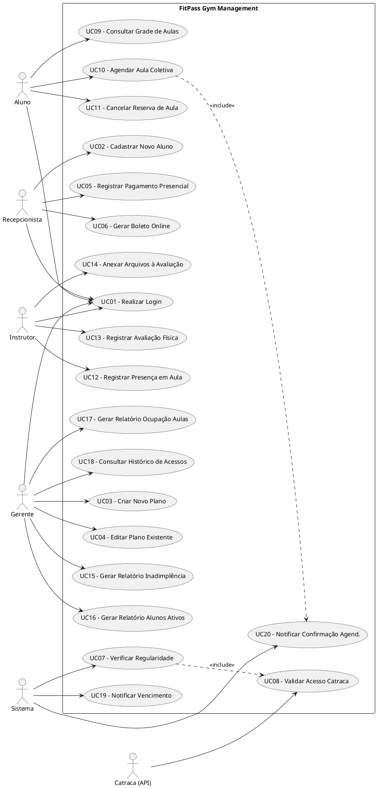
```plantuml
@startuml FitPass_CasosDeUso

left to right direction
skinparam packageStyle rectangle

actor "Aluno" as AL
actor "Recepcionista" as RE
actor "Instrutor" as IN
actor "Gerente" as GE
actor "Sistema" as SI
actor "Catraca (API)" as CA

rectangle "FitPass Gym Management" {
  usecase "UC01 - Realizar Login" as UC01
  usecase "UC02 - Cadastrar Novo Aluno" as UC02
  usecase "UC03 - Criar Novo Plano" as UC03
  usecase "UC04 - Editar Plano Existente" as UC04
  usecase "UC05 - Registrar Pagamento Presencial" as UC05
  usecase "UC06 - Gerar Boleto Online" as UC06
  usecase "UC07 - Verificar Regularidade" as UC07
  usecase "UC08 - Validar Acesso Catraca" as UC08
  usecase "UC09 - Consultar Grade de Aulas" as UC09
  usecase "UC10 - Agendar Aula Coletiva" as UC10
  usecase "UC11 - Cancelar Reserva de Aula" as UC11
  usecase "UC12 - Registrar Presença em Aula" as UC12
  usecase "UC13 - Registrar Avaliação Física" as UC13
  usecase "UC14 - Anexar Arquivos à Avaliação" as UC14
  usecase "UC15 - Gerar Relatório Inadimplência" as UC15
  usecase "UC16 - Gerar Relatório Alunos Ativos" as UC16
  usecase "UC17 - Gerar Relatório Ocupação Aulas" as UC17
  usecase "UC18 - Consultar Histórico de Acessos" as UC18
  usecase "UC19 - Notificar Vencimento" as UC19
  usecase "UC20 - Notificar Confirmação Agend." as UC20
}

AL --> UC01
AL --> UC09
AL --> UC10
AL --> UC11

RE --> UC01
RE --> UC02
RE --> UC05
RE --> UC06

IN --> UC01
IN --> UC12
IN --> UC13
IN --> UC14

GE --> UC01
GE --> UC03
GE --> UC04
GE --> UC15
GE --> UC16
GE --> UC17
GE --> UC18

SI --> UC07
SI --> UC19
SI --> UC20

CA --> UC08

UC10 ..> UC20 : <<include>>
UC07 ..> UC08 : <<include>>

@enduml
```

---

## Documentação dos Casos de Uso e Diagramas de Atividade

---

### UC01 — Realizar Login

| Campo | Descrição |
|---|---|
| **Ator Principal** | Usuário (Aluno, Recepcionista, Instrutor, Gerente) |
| **Objetivo** | Permitir que o usuário acesse o sistema com suas credenciais. |
| **Pré-condições** | Usuário deve possuir cadastro ativo no sistema. |
| **Pós-condições** | Sessão iniciada com sucesso e usuário redirecionado ao painel correspondente ao seu perfil. |
| **RF Relacionados** | RF01, RF09 |
| **RNF Relacionados** | RNF02 (Segurança), RNF03 (Tempo de Resposta) |
| **RN Relacionadas** | RN06 |

**Fluxo Principal:**
1. O usuário informa e-mail e senha na tela de login.
2. O sistema valida as credenciais informadas.
3. O sistema autentica o usuário e redireciona para a tela inicial do seu perfil.

**Fluxos Alternativos:**
- **A1 — Senha incorreta:** O sistema exibe mensagem de erro genérica e permite nova tentativa.
- **A2 — Conta bloqueada:** O sistema impede o login e instrui o usuário a recuperar o acesso via e-mail.

**Diagrama de Atividade:**

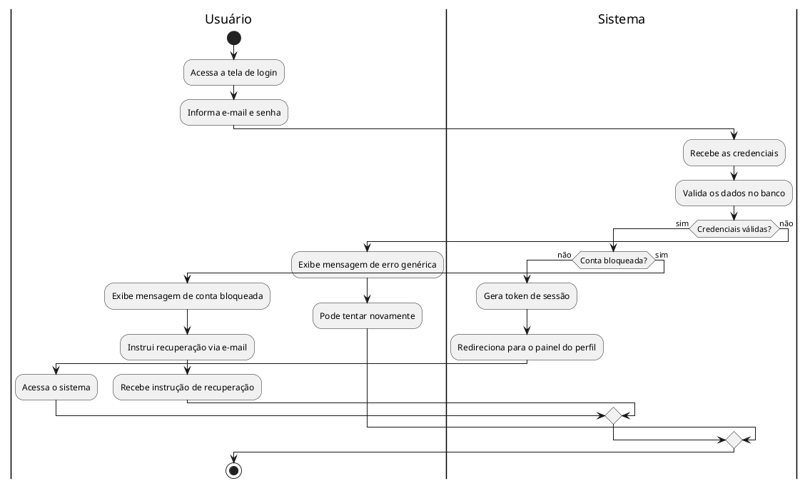
```plantuml
@startuml UC01_Login

|Usuário|
start
:Acessa a tela de login;
:Informa e-mail e senha;

|Sistema|
:Recebe as credenciais;
:Valida os dados no banco;

if (Credenciais válidas?) then (sim)
  if (Conta bloqueada?) then (não)
    :Gera token de sessão;
    :Redireciona para o painel do perfil;
    |Usuário|
    :Acessa o sistema;
  else (sim)
    :Exibe mensagem de conta bloqueada;
    :Instrui recuperação via e-mail;
    |Usuário|
    :Recebe instrução de recuperação;
  endif
else (não)
  :Exibe mensagem de erro genérica;
  |Usuário|
  :Pode tentar novamente;
endif

stop
@enduml
```

---

### UC02 — Cadastrar Novo Aluno

| Campo | Descrição |
|---|---|
| **Ator Principal** | Recepcionista |
| **Objetivo** | Registrar um novo cliente na base de dados da academia. |
| **Pré-condições** | Recepcionista autenticado no sistema. |
| **Pós-condições** | Aluno registrado com dados pessoais, endereço e plano inicial vinculado. |
| **RF Relacionados** | RF01 |
| **RNF Relacionados** | RNF02 (Segurança), RNF04 (Usabilidade) |
| **RN Relacionadas** | RN06 |

**Fluxo Principal:**
1. A recepcionista acessa o módulo de matrículas.
2. O sistema solicita dados: Nome, CPF, Endereço, Contato e Plano.
3. A recepcionista preenche as informações.
4. O sistema valida os campos obrigatórios e salva o registro.

**Fluxos Alternativos:**
- **A1 — CPF já cadastrado:** O sistema alerta que o aluno já existe e impede a duplicidade.

**Diagrama de Atividade:**

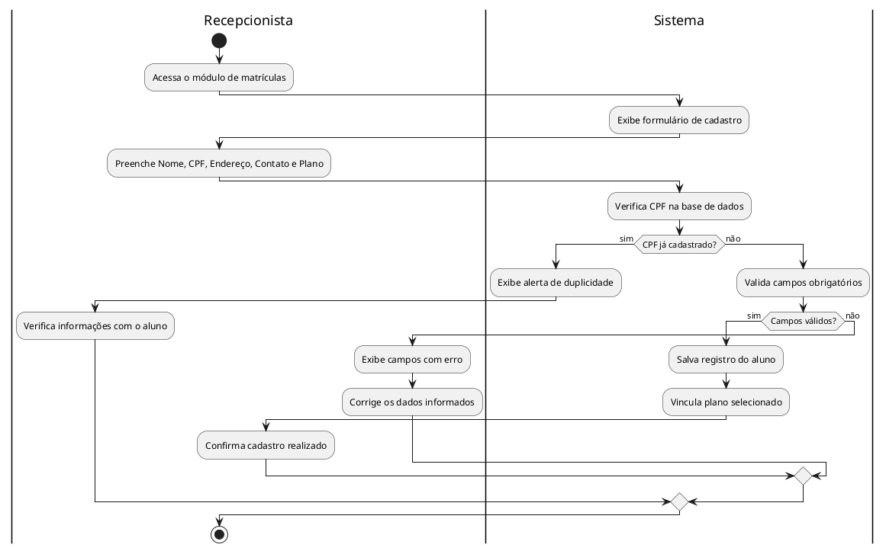
```plantuml
@startuml UC02_CadastrarAluno

|Recepcionista|
start
:Acessa o módulo de matrículas;

|Sistema|
:Exibe formulário de cadastro;

|Recepcionista|
:Preenche Nome, CPF, Endereço, Contato e Plano;

|Sistema|
:Verifica CPF na base de dados;

if (CPF já cadastrado?) then (sim)
  :Exibe alerta de duplicidade;
  |Recepcionista|
  :Verifica informações com o aluno;
else (não)
  |Sistema|
  :Valida campos obrigatórios;
  if (Campos válidos?) then (sim)
    :Salva registro do aluno;
    :Vincula plano selecionado;
    |Recepcionista|
    :Confirma cadastro realizado;
  else (não)
    :Exibe campos com erro;
    |Recepcionista|
    :Corrige os dados informados;
  endif
endif

stop
@enduml
```

---

### UC03 — Criar Novo Plano de Academia

| Campo | Descrição |
|---|---|
| **Ator Principal** | Gerente |
| **Objetivo** | Definir novas modalidades de planos disponíveis para venda. |
| **Pré-condições** | Gerente autenticado no sistema. |
| **Pós-condições** | Novo tipo de plano disponível para seleção nas matrículas. |
| **RF Relacionados** | RF02 |
| **RNF Relacionados** | RNF05 (Escalabilidade) |
| **RN Relacionadas** | RN06 |

**Fluxo Principal:**
1. O gerente acessa "Configurações de Planos".
2. O gerente define o nome, valor, duração e modalidades incluídas.
3. O sistema armazena a nova configuração e disponibiliza o plano.

**Fluxos Alternativos:**
- **A1 — Valor inválido:** O sistema solicita correção de valores negativos ou zerados.

**Diagrama de Atividade:**

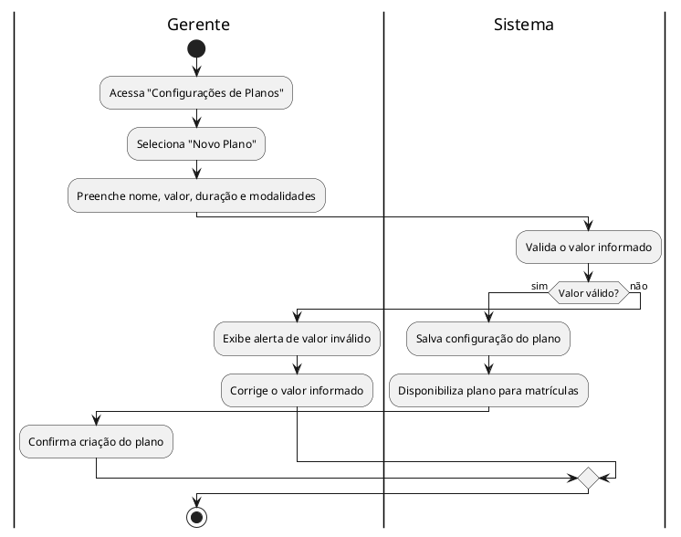
```plantuml
@startuml UC03_CriarPlano

|Gerente|
start
:Acessa "Configurações de Planos";
:Seleciona "Novo Plano";
:Preenche nome, valor, duração e modalidades;

|Sistema|
:Valida o valor informado;

if (Valor válido?) then (sim)
  :Salva configuração do plano;
  :Disponibiliza plano para matrículas;
  |Gerente|
  :Confirma criação do plano;
else (não)
  :Exibe alerta de valor inválido;
  |Gerente|
  :Corrige o valor informado;
endif

stop
@enduml
```

---

### UC04 — Editar Plano Existente

| Campo | Descrição |
|---|---|
| **Ator Principal** | Gerente |
| **Objetivo** | Alterar valores ou condições de um plano já cadastrado. |
| **Pré-condições** | Plano deve estar cadastrado no sistema. |
| **Pós-condições** | Dados do plano atualizados e válidos para novas vendas. |
| **RF Relacionados** | RF02 |
| **RNF Relacionados** | RNF01 (Disponibilidade) |
| **RN Relacionadas** | RN06 |

**Fluxo Principal:**
1. O gerente busca o plano desejado.
2. O sistema exibe os dados atuais do plano.
3. O gerente altera as informações necessárias.
4. O sistema valida e salva as alterações.

**Fluxos Alternativos:**
- **A1 — Plano com alunos ativos:** O sistema avisa que a mudança afetará apenas novas adesões.

**Diagrama de Atividade:**

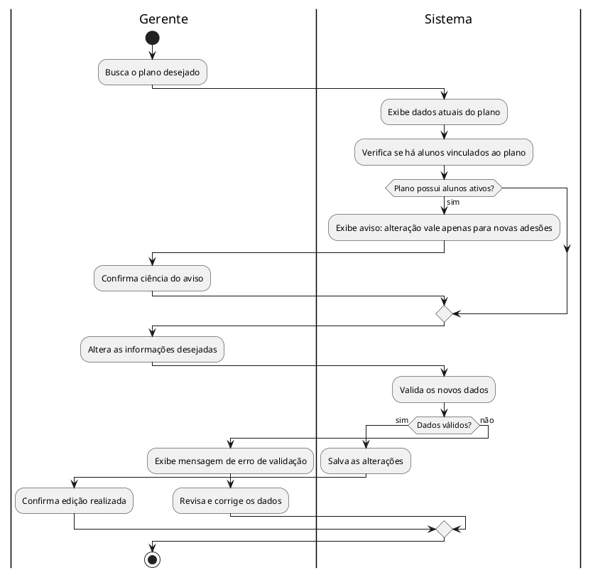
```plantuml
@startuml UC04_EditarPlano

|Gerente|
start
:Busca o plano desejado;

|Sistema|
:Exibe dados atuais do plano;
:Verifica se há alunos vinculados ao plano;

if (Plano possui alunos ativos?) then (sim)
  :Exibe aviso: alteração vale apenas para novas adesões;
  |Gerente|
  :Confirma ciência do aviso;
endif

|Gerente|
:Altera as informações desejadas;

|Sistema|
:Valida os novos dados;

if (Dados válidos?) then (sim)
  :Salva as alterações;
  |Gerente|
  :Confirma edição realizada;
else (não)
  :Exibe mensagem de erro de validação;
  |Gerente|
  :Revisa e corrige os dados;
endif

stop
@enduml
```

---

### UC05 — Registrar Pagamento Presencial

| Campo | Descrição |
|---|---|
| **Ator Principal** | Recepcionista |
| **Objetivo** | Registrar a quitação de mensalidade realizada na recepção. |
| **Pré-condições** | Aluno selecionado e com débito pendente. |
| **Pós-condições** | Pagamento registrado e situação do aluno atualizada imediatamente (RN07). |
| **RF Relacionados** | RF03, RF04 |
| **RNF Relacionados** | RNF03 (Tempo de Resposta) |
| **RN Relacionadas** | RN04, RN06, RN07 |

**Fluxo Principal:**
1. O recepcionista seleciona o aluno e a parcela em aberto.
2. O sistema solicita a forma de pagamento: Dinheiro, Cartão ou PIX.
3. O recepcionista confirma o recebimento do valor integral (RN04).
4. O sistema gera o comprovante e atualiza o status financeiro imediatamente.

**Fluxos Alternativos:**
- **A1 — Pagamento parcial:** O sistema bloqueia a operação informando que não é permitido (RN04).

**Diagrama de Atividade:**

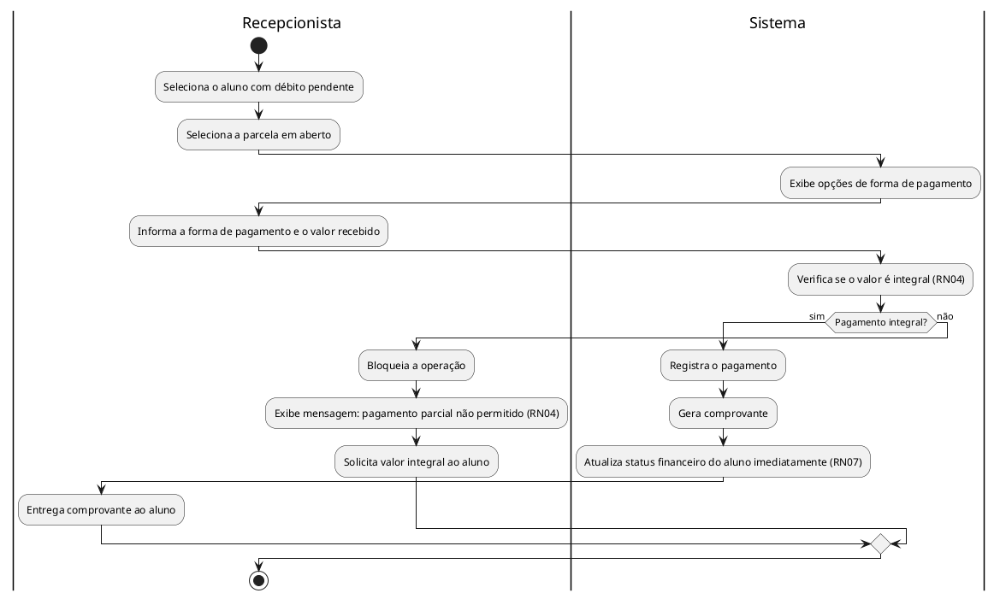
```plantuml
@startuml UC05_PagamentoPresencial

|Recepcionista|
start
:Seleciona o aluno com débito pendente;
:Seleciona a parcela em aberto;

|Sistema|
:Exibe opções de forma de pagamento;

|Recepcionista|
:Informa a forma de pagamento e o valor recebido;

|Sistema|
:Verifica se o valor é integral (RN04);

if (Pagamento integral?) then (sim)
  :Registra o pagamento;
  :Gera comprovante;
  :Atualiza status financeiro do aluno imediatamente (RN07);
  |Recepcionista|
  :Entrega comprovante ao aluno;
else (não)
  :Bloqueia a operação;
  :Exibe mensagem: pagamento parcial não permitido (RN04);
  |Recepcionista|
  :Solicita valor integral ao aluno;
endif

stop
@enduml
```

---

### UC06 — Gerar Boleto para Pagamento Online

| Campo | Descrição |
|---|---|
| **Ator Principal** | Recepcionista |
| **Objetivo** | Emitir documento de cobrança para pagamento remoto pelo aluno. |
| **Pré-condições** | Integração financeira ativa no sistema. |
| **Pós-condições** | Boleto gerado e disponibilizado no perfil do aluno. |
| **RF Relacionados** | RF03 |
| **RNF Relacionados** | RNF06 (Integração) |
| **RN Relacionadas** | RN06 |

**Fluxo Principal:**
1. O recepcionista solicita a emissão de cobrança para o aluno selecionado.
2. O sistema se comunica com a API bancária.
3. O sistema gera o link do boleto e o salva no perfil do aluno.

**Fluxos Alternativos:**
- **A1 — Falha na API:** O sistema avisa sobre a indisponibilidade e sugere tentar novamente.

**Diagrama de Atividade:**

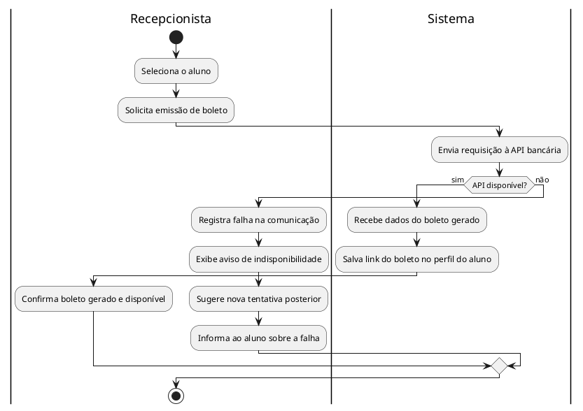
```plantuml
@startuml UC06_GerarBoleto

|Recepcionista|
start
:Seleciona o aluno;
:Solicita emissão de boleto;

|Sistema|
:Envia requisição à API bancária;

if (API disponível?) then (sim)
  :Recebe dados do boleto gerado;
  :Salva link do boleto no perfil do aluno;
  |Recepcionista|
  :Confirma boleto gerado e disponível;
else (não)
  :Registra falha na comunicação;
  :Exibe aviso de indisponibilidade;
  :Sugere nova tentativa posterior;
  |Recepcionista|
  :Informa ao aluno sobre a falha;
endif

stop
@enduml
```

---

### UC07 — Verificar Regularidade do Aluno (Automático)

| Campo | Descrição |
|---|---|
| **Ator Principal** | Sistema |
| **Objetivo** | Monitorar diariamente o status financeiro de todos os alunos. |
| **Pré-condições** | Rotina agendada configurada ou gatilho de acesso ativo. |
| **Pós-condições** | Status do aluno atualizado para "Inadimplente" ou "Regular". |
| **RF Relacionados** | RF04 |
| **RNF Relacionados** | RNF01 (Disponibilidade) |
| **RN Relacionadas** | RN01, RN07 |

**Fluxo Principal:**
1. O sistema verifica a data de vencimento das parcelas de todos os alunos.
2. O sistema identifica alunos com pagamentos atrasados.
3. Se o atraso for superior a 5 dias, o sistema marca o aluno para bloqueio (RN01).

**Fluxos Alternativos:**
- **A1 — Pagamento identificado:** O sistema restaura a regularidade do aluno imediatamente (RN07).

**Diagrama de Atividade:**

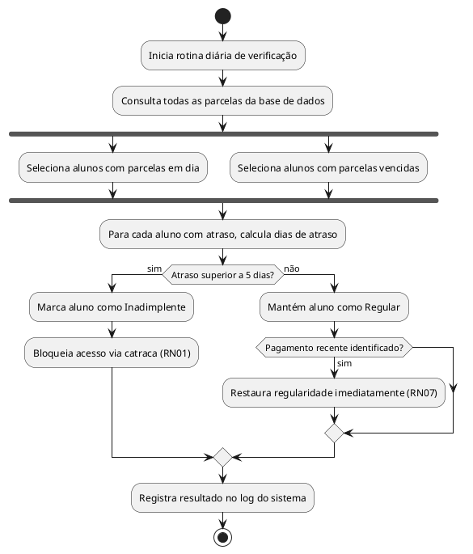
```plantuml
@startuml UC07_VerificarRegularidade

|Sistema|
start
:Inicia rotina diária de verificação;
:Consulta todas as parcelas da base de dados;

fork
  :Seleciona alunos com parcelas em dia;
fork again
  :Seleciona alunos com parcelas vencidas;
end fork

:Para cada aluno com atraso, calcula dias de atraso;

if (Atraso superior a 5 dias?) then (sim)
  :Marca aluno como Inadimplente;
  :Bloqueia acesso via catraca (RN01);
else (não)
  :Mantém aluno como Regular;
  if (Pagamento recente identificado?) then (sim)
    :Restaura regularidade imediatamente (RN07);
  endif
endif

:Registra resultado no log do sistema;
stop
@enduml
```

---

### UC08 — Validar Acesso na Catraca

| Campo | Descrição |
|---|---|
| **Ator Principal** | Sistema de Catraca (API) |
| **Objetivo** | Liberar ou bloquear a entrada física do aluno via RFID. |
| **Pré-condições** | Aluno posiciona a tag RFID no leitor da catraca. |
| **Pós-condições** | Acesso liberado e registro salvo, ou bloqueio exibido ao aluno. |
| **RF Relacionados** | RF04, RF05 |
| **RNF Relacionados** | RNF03 (Tempo de Resposta: até 3s), RNF06 (Integração via API REST/JSON) |
| **RN Relacionadas** | RN01 |

**Fluxo Principal:**
1. O aluno aproxima o cartão/pulseira RFID do leitor.
2. O sistema de catraca envia o ID para o servidor FitPass via API REST.
3. O sistema verifica a regularidade do aluno.
4. Se regular ou com atraso de até 5 dias, envia sinal de liberação.

**Fluxos Alternativos:**
- **A1 — Inadimplência superior a 5 dias:** O sistema nega o acesso e orienta ao aluno.
- **A2 — RFID não reconhecido:** O sistema retorna credencial inválida.

**Diagrama de Atividade:**

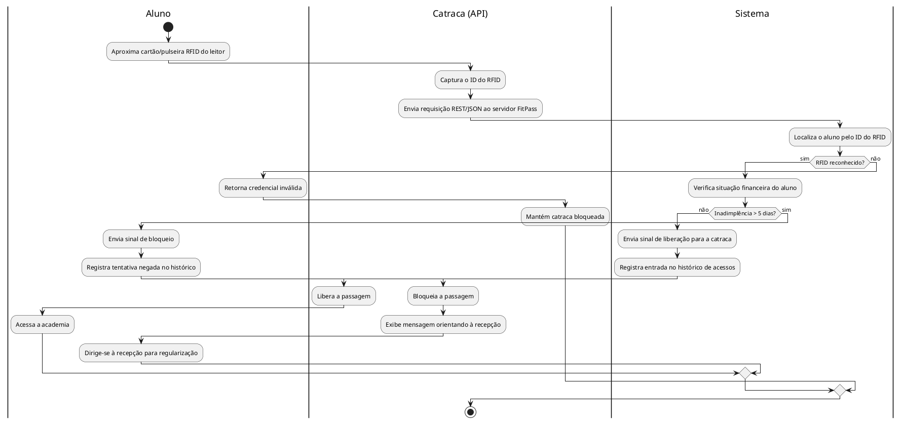
```plantuml
@startuml UC08_ValidarCatraca

|Aluno|
start
:Aproxima cartão/pulseira RFID do leitor;

|Catraca (API)|
:Captura o ID do RFID;
:Envia requisição REST/JSON ao servidor FitPass;

|Sistema|
:Localiza o aluno pelo ID do RFID;

if (RFID reconhecido?) then (sim)
  :Verifica situação financeira do aluno;
  if (Inadimplência > 5 dias?) then (não)
    :Envia sinal de liberação para a catraca;
    :Registra entrada no histórico de acessos;
    |Catraca (API)|
    :Libera a passagem;
    |Aluno|
    :Acessa a academia;
  else (sim)
    :Envia sinal de bloqueio;
    :Registra tentativa negada no histórico;
    |Catraca (API)|
    :Bloqueia a passagem;
    :Exibe mensagem orientando à recepção;
    |Aluno|
    :Dirige-se à recepção para regularização;
  endif
else (não)
  :Retorna credencial inválida;
  |Catraca (API)|
  :Mantém catraca bloqueada;
endif

stop
@enduml
```

---

### UC09 — Consultar Grade de Aulas

| Campo | Descrição |
|---|---|
| **Ator Principal** | Aluno |
| **Objetivo** | Visualizar horários, modalidades e vagas disponíveis nas aulas. |
| **Pré-condições** | Aluno autenticado no aplicativo ou portal. |
| **Pós-condições** | Informações de horários exibidas ao aluno. |
| **RF Relacionados** | RF06 |
| **RNF Relacionados** | RNF04 (Usabilidade) |
| **RN Relacionadas** | Nenhuma |

**Fluxo Principal:**
1. O aluno acessa o módulo de "Agendamentos".
2. O sistema exibe a lista de aulas com horários, instrutores e vagas disponíveis.

**Fluxos Alternativos:**
- **A1 — Nenhuma aula cadastrada:** O sistema informa que não há horários disponíveis.

**Diagrama de Atividade:**

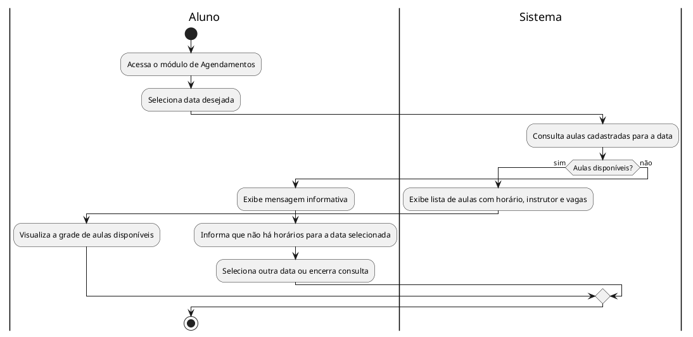
```plantuml
@startuml UC09_ConsultarGrade

|Aluno|
start
:Acessa o módulo de Agendamentos;
:Seleciona data desejada;

|Sistema|
:Consulta aulas cadastradas para a data;

if (Aulas disponíveis?) then (sim)
  :Exibe lista de aulas com horário, instrutor e vagas;
  |Aluno|
  :Visualiza a grade de aulas disponíveis;
else (não)
  :Exibe mensagem informativa;
  :Informa que não há horários para a data selecionada;
  |Aluno|
  :Seleciona outra data ou encerra consulta;
endif

stop
@enduml
```

---

### UC10 — Agendar Aula Coletiva

| Campo | Descrição |
|---|---|
| **Ator Principal** | Aluno |
| **Objetivo** | Reservar uma vaga em uma aula específica. |
| **Pré-condições** | Aluno deve estar regular e a aula deve ter vagas disponíveis. |
| **Pós-condições** | Reserva confirmada e vaga subtraída do total disponível. |
| **RF Relacionados** | RF06, RF10 |
| **RNF Relacionados** | RNF04 (Usabilidade) |
| **RN Relacionadas** | RN01, RN02 |

**Fluxo Principal:**
1. O aluno seleciona a aula desejada na grade de horários.
2. O sistema verifica o limite de vagas (RN02).
3. O sistema confirma a reserva e envia notificação de confirmação (RF10).

**Fluxos Alternativos:**
- **A1 — Aula lotada:** O sistema informa que não há vagas (RN02).
- **A2 — Aluno inadimplente:** O sistema impede o agendamento (RN01).

**Diagrama de Atividade:**

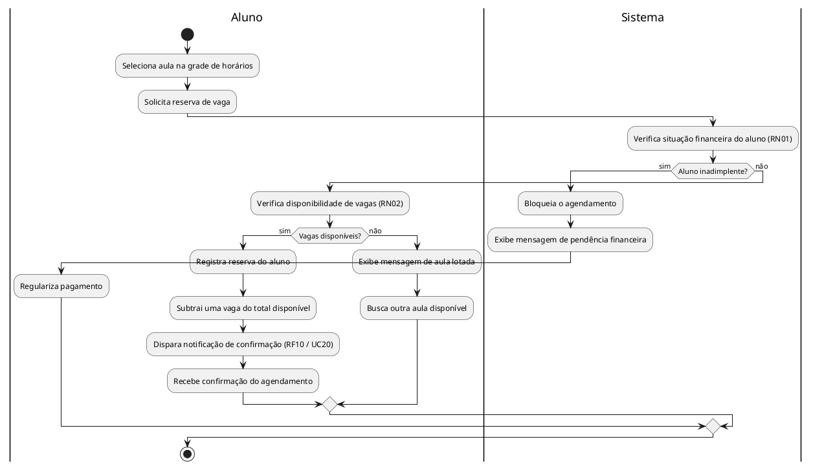
```plantuml
@startuml UC10_AgendarAula

|Aluno|
start
:Seleciona aula na grade de horários;
:Solicita reserva de vaga;

|Sistema|
:Verifica situação financeira do aluno (RN01);

if (Aluno inadimplente?) then (sim)
  :Bloqueia o agendamento;
  :Exibe mensagem de pendência financeira;
  |Aluno|
  :Regulariza pagamento;
else (não)
  :Verifica disponibilidade de vagas (RN02);
  if (Vagas disponíveis?) then (sim)
    :Registra reserva do aluno;
    :Subtrai uma vaga do total disponível;
    :Dispara notificação de confirmação (RF10 / UC20);
    |Aluno|
    :Recebe confirmação do agendamento;
  else (não)
    :Exibe mensagem de aula lotada;
    |Aluno|
    :Busca outra aula disponível;
  endif
endif

stop
@enduml
```

---

### UC11 — Cancelar Reserva de Aula

| Campo | Descrição |
|---|---|
| **Ator Principal** | Aluno |
| **Objetivo** | Desistir da participação em uma aula previamente agendada. |
| **Pré-condições** | Reserva ativa no sistema. |
| **Pós-condições** | Vaga liberada para outros alunos. |
| **RF Relacionados** | RF06 |
| **RNF Relacionados** | RNF04 (Usabilidade) |
| **RN Relacionadas** | RN02, RN03 |

**Fluxo Principal:**
1. O aluno acessa seus agendamentos e solicita o cancelamento.
2. O sistema verifica se o horário atual é pelo menos 1 hora antes do início da aula (RN03).
3. O sistema confirma o cancelamento e libera a vaga.

**Fluxos Alternativos:**
- **A1 — Fora do prazo:** O sistema impede o cancelamento pois falta menos de 1 hora (RN03).

**Diagrama de Atividade:**

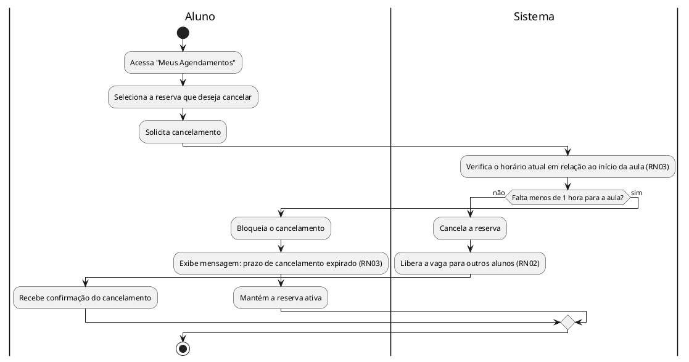
```plantuml
@startuml UC11_CancelarReserva

|Aluno|
start
:Acessa "Meus Agendamentos";
:Seleciona a reserva que deseja cancelar;
:Solicita cancelamento;

|Sistema|
:Verifica o horário atual em relação ao início da aula (RN03);

if (Falta menos de 1 hora para a aula?) then (não)
  :Cancela a reserva;
  :Libera a vaga para outros alunos (RN02);
  |Aluno|
  :Recebe confirmação do cancelamento;
else (sim)
  :Bloqueia o cancelamento;
  :Exibe mensagem: prazo de cancelamento expirado (RN03);
  |Aluno|
  :Mantém a reserva ativa;
endif

stop
@enduml
```

---

### UC12 — Registrar Presença em Aula

| Campo | Descrição |
|---|---|
| **Ator Principal** | Instrutor |
| **Objetivo** | Confirmar a participação dos alunos presentes na aula. |
| **Pré-condições** | Aula em andamento ou recém-finalizada. |
| **Pós-condições** | Lista de presença salva no histórico de cada aluno. |
| **RF Relacionados** | RF07 |
| **RNF Relacionados** | RNF01 (Disponibilidade) |
| **RN Relacionadas** | RN06 |

**Fluxo Principal:**
1. O instrutor acessa a aula agendada no sistema.
2. O sistema exibe a lista de alunos que reservaram vaga.
3. O instrutor marca os alunos presentes.
4. O sistema salva as informações com data e hora.

**Fluxos Alternativos:**
- **A1 — Aluno não agendado presente:** O instrutor pode adicionar manualmente se houver vaga.

**Diagrama de Atividade:**

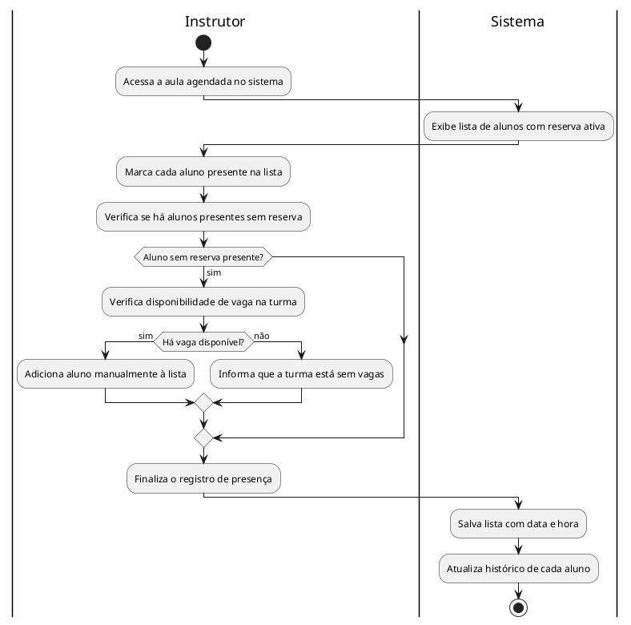
```plantuml
@startuml UC12_RegistrarPresenca

|Instrutor|
start
:Acessa a aula agendada no sistema;

|Sistema|
:Exibe lista de alunos com reserva ativa;

|Instrutor|
:Marca cada aluno presente na lista;
:Verifica se há alunos presentes sem reserva;

if (Aluno sem reserva presente?) then (sim)
  :Verifica disponibilidade de vaga na turma;
  if (Há vaga disponível?) then (sim)
    :Adiciona aluno manualmente à lista;
  else (não)
    :Informa que a turma está sem vagas;
  endif
endif

|Instrutor|
:Finaliza o registro de presença;

|Sistema|
:Salva lista com data e hora;
:Atualiza histórico de cada aluno;

stop
@enduml
```

---

### UC13 — Registrar Avaliação Física

| Campo | Descrição |
|---|---|
| **Ator Principal** | Instrutor |
| **Objetivo** | Cadastrar as métricas corporais do aluno no sistema. |
| **Pré-condições** | Aluno deve estar ativo e regular (RN05). |
| **Pós-condições** | Avaliação salva no perfil do aluno e disponível para consulta. |
| **RF Relacionados** | RF08 |
| **RNF Relacionados** | RNF02 (Segurança), RNF04 (Usabilidade) |
| **RN Relacionadas** | RN05, RN06 |

**Fluxo Principal:**
1. O instrutor inicia a avaliação física do aluno.
2. O sistema verifica o status do aluno (RN05).
3. O instrutor insere peso, altura, dobras cutâneas e demais medidas.
4. O sistema calcula o IMC e demais indicadores e salva a avaliação.

**Fluxos Alternativos:**
- **A1 — Aluno irregular:** O sistema bloqueia o início da avaliação (RN05).

**Diagrama de Atividade:**

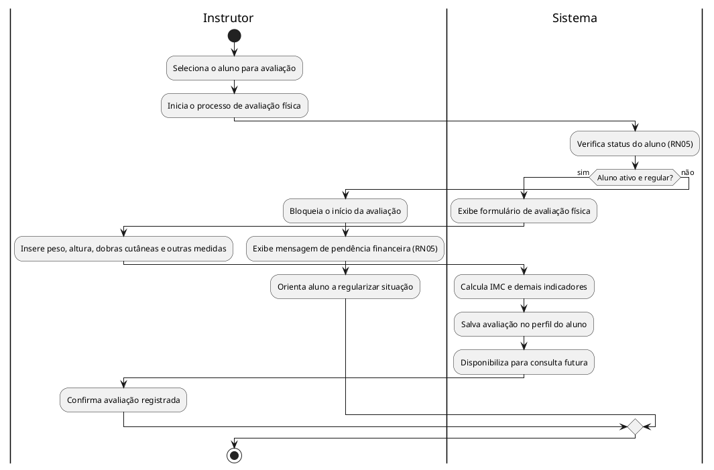
```plantuml
@startuml UC13_AvaliacaoFisica

|Instrutor|
start
:Seleciona o aluno para avaliação;
:Inicia o processo de avaliação física;

|Sistema|
:Verifica status do aluno (RN05);

if (Aluno ativo e regular?) then (sim)
  :Exibe formulário de avaliação física;
  |Instrutor|
  :Insere peso, altura, dobras cutâneas e outras medidas;
  |Sistema|
  :Calcula IMC e demais indicadores;
  :Salva avaliação no perfil do aluno;
  :Disponibiliza para consulta futura;
  |Instrutor|
  :Confirma avaliação registrada;
else (não)
  :Bloqueia o início da avaliação;
  :Exibe mensagem de pendência financeira (RN05);
  |Instrutor|
  :Orienta aluno a regularizar situação;
endif

stop
@enduml
```

---

### UC14 — Anexar Arquivos à Avaliação Física

| Campo | Descrição |
|---|---|
| **Ator Principal** | Instrutor |
| **Objetivo** | Adicionar fotos ou laudos externos ao registro de avaliação do aluno. |
| **Pré-condições** | Avaliação física aberta para edição no sistema. |
| **Pós-condições** | Arquivos vinculados ao perfil do aluno e à avaliação correspondente. |
| **RF Relacionados** | RF08 |
| **RNF Relacionados** | RNF02 (Segurança) |
| **RN Relacionadas** | RN06 |

**Fluxo Principal:**
1. O instrutor seleciona a opção "Anexar Arquivos" na avaliação.
2. O instrutor escolhe as imagens ou PDFs desejados.
3. O sistema realiza o upload e vincula os arquivos à avaliação atual.

**Fluxos Alternativos:**
- **A1 — Arquivo acima do limite:** O sistema rejeita e solicita arquivo menor.

**Diagrama de Atividade:**

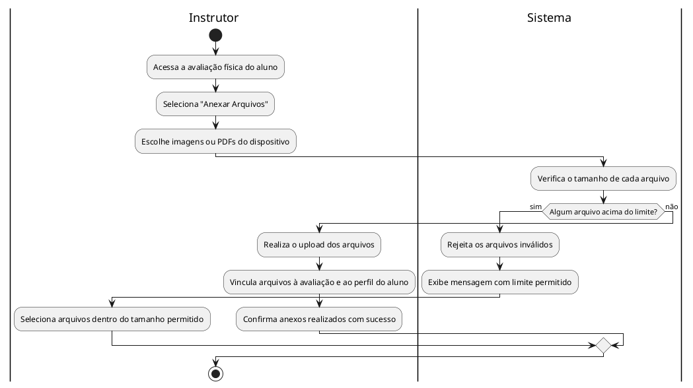
```plantuml
@startuml UC14_AnexarArquivos

|Instrutor|
start
:Acessa a avaliação física do aluno;
:Seleciona "Anexar Arquivos";
:Escolhe imagens ou PDFs do dispositivo;

|Sistema|
:Verifica o tamanho de cada arquivo;

if (Algum arquivo acima do limite?) then (sim)
  :Rejeita os arquivos inválidos;
  :Exibe mensagem com limite permitido;
  |Instrutor|
  :Seleciona arquivos dentro do tamanho permitido;
else (não)
  :Realiza o upload dos arquivos;
  :Vincula arquivos à avaliação e ao perfil do aluno;
  |Instrutor|
  :Confirma anexos realizados com sucesso;
endif

stop
@enduml
```

---

### UC15 — Gerar Relatório de Inadimplência

| Campo | Descrição |
|---|---|
| **Ator Principal** | Gerente |
| **Objetivo** | Identificar todos os alunos com pagamentos atrasados. |
| **Pré-condições** | Gerente autenticado com perfil gerencial. |
| **Pós-condições** | Lista de inadimplentes exibida e disponível para exportação. |
| **RF Relacionados** | RF09 |
| **RNF Relacionados** | RNF01 (Disponibilidade), RNF05 (Escalabilidade) |
| **RN Relacionadas** | RN01, RN06 |

**Fluxo Principal:**
1. O gerente solicita o relatório de inadimplência.
2. O sistema filtra os pagamentos vencidos e não pagos.
3. O sistema exibe nome, valor em aberto e dias de atraso de cada aluno.

**Fluxos Alternativos:**
- **A1 — Filtro por período:** O gerente pode restringir por datas de início e fim.

**Diagrama de Atividade:**

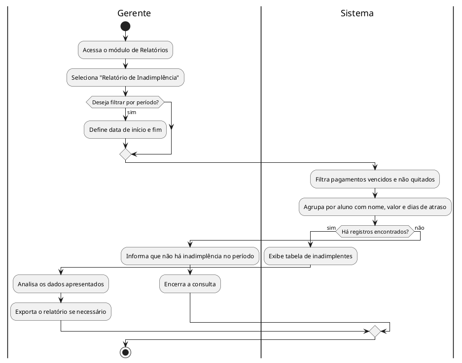
```plantuml
@startuml UC15_RelatorioInadimplencia

|Gerente|
start
:Acessa o módulo de Relatórios;
:Seleciona "Relatório de Inadimplência";

if (Deseja filtrar por período?) then (sim)
  :Define data de início e fim;
endif

|Sistema|
:Filtra pagamentos vencidos e não quitados;
:Agrupa por aluno com nome, valor e dias de atraso;

if (Há registros encontrados?) then (sim)
  :Exibe tabela de inadimplentes;
  |Gerente|
  :Analisa os dados apresentados;
  :Exporta o relatório se necessário;
else (não)
  :Informa que não há inadimplência no período;
  |Gerente|
  :Encerra a consulta;
endif

stop
@enduml
```

---

### UC16 — Gerar Relatório de Alunos Ativos

| Campo | Descrição |
|---|---|
| **Ator Principal** | Gerente |
| **Objetivo** | Listar todos os alunos com matrículas vigentes. |
| **Pré-condições** | Gerente autenticado com permissões administrativas. |
| **Pós-condições** | Relatório gerado com a lista de membros ativos. |
| **RF Relacionados** | RF09 |
| **RNF Relacionados** | RNF01 (Disponibilidade), RNF05 (Escalabilidade) |
| **RN Relacionadas** | RN06 |

**Fluxo Principal:**
1. O gerente acessa o menu "Relatórios Gerenciais".
2. O gerente seleciona "Relatório de Alunos Ativos".
3. O sistema consulta a base filtrando alunos com planos ativos e situação regular.
4. O sistema exibe a lista com Nome, Plano, Data de Expiração e Último Acesso.

**Fluxos Alternativos:**
- **A1 — Nenhum registro encontrado:** O sistema informa que não há alunos ativos.

**Diagrama de Atividade:**

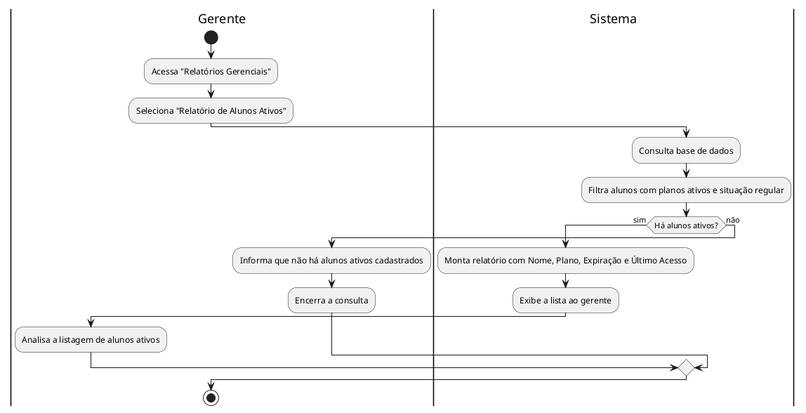
```plantuml
@startuml UC16_RelatorioAlunosAtivos

|Gerente|
start
:Acessa "Relatórios Gerenciais";
:Seleciona "Relatório de Alunos Ativos";

|Sistema|
:Consulta base de dados;
:Filtra alunos com planos ativos e situação regular;

if (Há alunos ativos?) then (sim)
  :Monta relatório com Nome, Plano, Expiração e Último Acesso;
  :Exibe a lista ao gerente;
  |Gerente|
  :Analisa a listagem de alunos ativos;
else (não)
  :Informa que não há alunos ativos cadastrados;
  |Gerente|
  :Encerra a consulta;
endif

stop
@enduml
```

---

### UC17 — Gerar Relatório de Ocupação de Aulas

| Campo | Descrição |
|---|---|
| **Ator Principal** | Gerente |
| **Objetivo** | Analisar a demanda e o desempenho das modalidades coletivas. |
| **Pré-condições** | Dados de agendamento e presença existentes no sistema. |
| **Pós-condições** | Relatório com percentuais de ocupação gerado. |
| **RF Relacionados** | RF09 |
| **RNF Relacionados** | RNF01 (Disponibilidade), RNF05 (Escalabilidade) |
| **RN Relacionadas** | RN02, RN06 |

**Fluxo Principal:**
1. O gerente acessa "Relatórios de Aulas".
2. O sistema processa a média de alunos por aula em relação à capacidade máxima.
3. O sistema gera gráficos e tabelas de desempenho das aulas.

**Fluxos Alternativos:**
- **A1 — Sem dados suficientes:** O sistema informa que não há dados para o período.

**Diagrama de Atividade:**

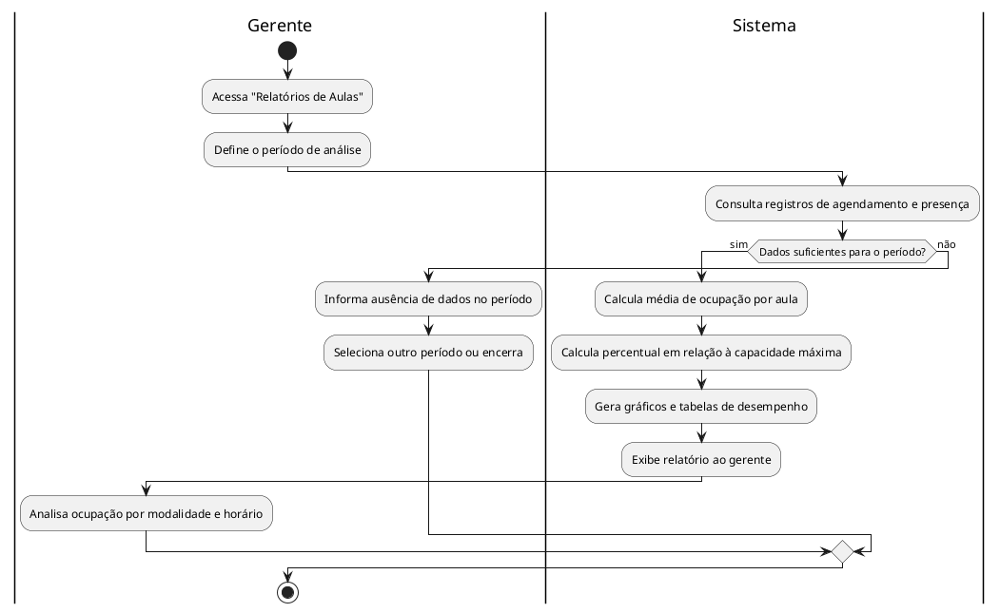
```plantuml
@startuml UC17_RelatorioOcupacao

|Gerente|
start
:Acessa "Relatórios de Aulas";
:Define o período de análise;

|Sistema|
:Consulta registros de agendamento e presença;

if (Dados suficientes para o período?) then (sim)
  :Calcula média de ocupação por aula;
  :Calcula percentual em relação à capacidade máxima;
  :Gera gráficos e tabelas de desempenho;
  :Exibe relatório ao gerente;
  |Gerente|
  :Analisa ocupação por modalidade e horário;
else (não)
  :Informa ausência de dados no período;
  |Gerente|
  :Seleciona outro período ou encerra;
endif

stop
@enduml
```

---

### UC18 — Consultar Histórico de Acessos

| Campo | Descrição |
|---|---|
| **Ator Principal** | Gerente |
| **Objetivo** | Monitorar o fluxo de pessoas e a frequência individual dos alunos. |
| **Pré-condições** | Registros de catraca existentes no sistema (UC08). |
| **Pós-condições** | Dados de frequência exibidos com detalhamento por aluno ou período. |
| **RF Relacionados** | RF09, RF05 |
| **RNF Relacionados** | RNF02 (Segurança), RNF05 (Escalabilidade) |
| **RN Relacionadas** | RN01, RN06 |

**Fluxo Principal:**
1. O gerente busca por um aluno ou data específica.
2. O sistema recupera todos os registros de entrada e saída do período.
3. O sistema exibe o histórico com data, hora e status de cada acesso.

**Fluxos Alternativos:**
- **A1 — Acesso negado registrado:** O sistema destaca em vermelho as tentativas bloqueadas (RN01).

**Diagrama de Atividade:**

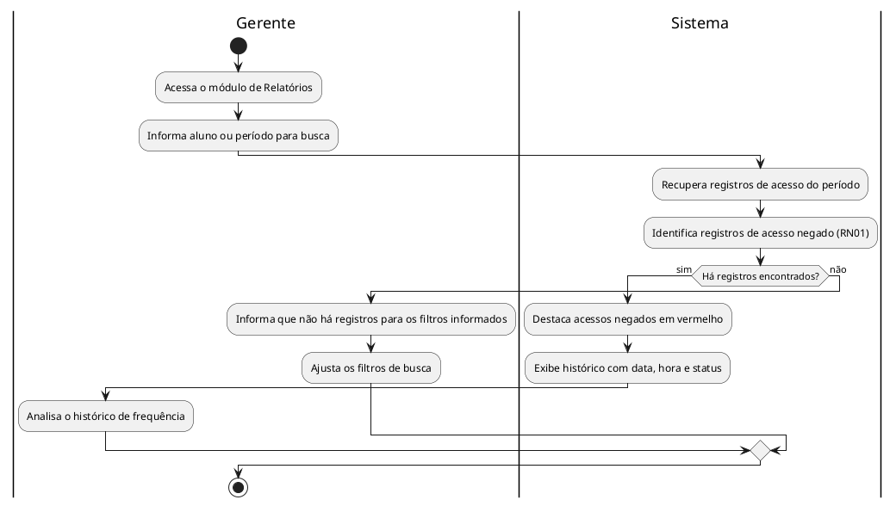
```plantuml
@startuml UC18_HistoricoAcessos

|Gerente|
start
:Acessa o módulo de Relatórios;
:Informa aluno ou período para busca;

|Sistema|
:Recupera registros de acesso do período;
:Identifica registros de acesso negado (RN01);

if (Há registros encontrados?) then (sim)
  :Destaca acessos negados em vermelho;
  :Exibe histórico com data, hora e status;
  |Gerente|
  :Analisa o histórico de frequência;
else (não)
  :Informa que não há registros para os filtros informados;
  |Gerente|
  :Ajusta os filtros de busca;
endif

stop
@enduml
```

---

### UC19 — Notificar Vencimento de Mensalidade

| Campo | Descrição |
|---|---|
| **Ator Principal** | Sistema |
| **Objetivo** | Alertar o aluno sobre o prazo de pagamento da mensalidade. |
| **Pré-condições** | Mensalidade próxima do vencimento (padrão: 3 dias antes). |
| **Pós-condições** | Notificação enviada ao e-mail ou aplicativo do aluno. |
| **RF Relacionados** | RF10 |
| **RNF Relacionados** | RNF01 (Disponibilidade) |
| **RN Relacionadas** | RN01 |

**Fluxo Principal:**
1. O sistema identifica parcelas que vencem nos próximos 3 dias.
2. O sistema dispara uma notificação automática ao aluno.
3. O sistema registra o envio no log de comunicações.

**Fluxos Alternativos:**
- **A1 — Falha no envio:** O sistema agenda nova tentativa em 4 horas.

**Diagrama de Atividade:**

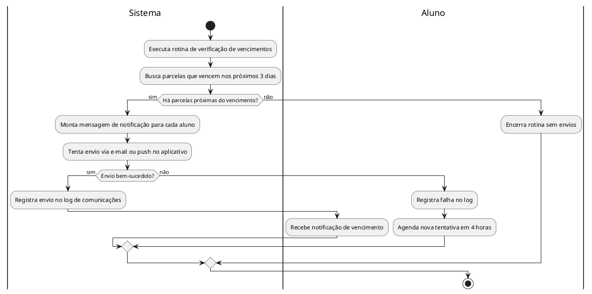
```plantuml
@startuml UC19_NotificarVencimento

|Sistema|
start
:Executa rotina de verificação de vencimentos;
:Busca parcelas que vencem nos próximos 3 dias;

if (Há parcelas próximas do vencimento?) then (sim)
  :Monta mensagem de notificação para cada aluno;
  :Tenta envio via e-mail ou push no aplicativo;

  if (Envio bem-sucedido?) then (sim)
    :Registra envio no log de comunicações;
    |Aluno|
    :Recebe notificação de vencimento;
  else (não)
    :Registra falha no log;
    :Agenda nova tentativa em 4 horas;
  endif
else (não)
  :Encerra rotina sem envios;
endif

stop
@enduml
```

---

### UC20 — Notificar Confirmação de Agendamento

| Campo | Descrição |
|---|---|
| **Ator Principal** | Sistema |
| **Objetivo** | Confirmar formalmente ao aluno que sua vaga foi reservada com sucesso. |
| **Pré-condições** | Conclusão bem-sucedida do UC10 (Agendar Aula Coletiva). |
| **Pós-condições** | Aluno recebe confirmação com os detalhes do agendamento. |
| **RF Relacionados** | RF10 |
| **RNF Relacionados** | RNF01 (Disponibilidade) |
| **RN Relacionadas** | RN02, RN03 |

**Fluxo Principal:**
1. Após a reserva (UC10), o sistema gera uma mensagem de confirmação automática.
2. O sistema envia notificação push ou e-mail ao aluno com dados da aula.
3. O sistema registra o envio no log de comunicações.

**Fluxos Alternativos:**
- **A1 — Aluno desativou notificações:** O sistema mantém apenas o registro interno no portal.

**Diagrama de Atividade:**

```plantuml
@startuml UC20_NotificarConfirmacao

|Sistema|
start
:Recebe evento de conclusão do UC10;
:Monta mensagem com dados da aula agendada;
:Verifica preferências de notificação do aluno;

if (Notificações ativas?) then (sim)
  :Envia push ou e-mail com detalhes da aula;
  :Registra envio no log de comunicações;
  |Aluno|
  :Recebe confirmação com data, horário e modalidade;
else (não)
  :Mantém apenas o registro interno no portal;
  :Registra evento no log;
  |Aluno|
  :Consulta confirmação pelo portal se necessário;
endif

stop
@enduml
```

---

*Documento elaborado por João Victor Zerbinati Cologi Pessoa (24001761) e Mariana Oliveira Paganotti (24001764) — UNIFEOB 2026.*
